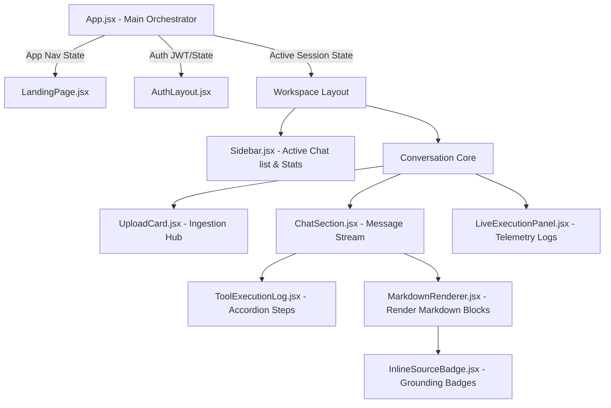

# NexusAI Frontend - Cinematic Multi-Agent Orchestration UI

This directory contains the source code for the frontend dashboard of the **NexusAI Platform**, a next-generation Multi-Agent RAG Orchestrator. 

Inspired by the design languages of Apple, Vercel, Linear, and Arc, the interface shifts the user experience from a generic chat input to a tactical, motion-driven dashboard showing live telemetry, agent pipeline traversals, and grounding citations.

---

## 🚀 Key Features

* **Multi-View Orchestrator:** Seamless routing between three core layouts:
  1. `landing`: Cinematic showcase of the agentic operating system with interactive node flow visualizers.
  2. `auth`: A dual-screen authentication gate displaying real-time agent execution trees.
  3. `workspace`: The main dashboard containing the file ingestion drop-zone, conversation hub, and telemetry controls.
* **Live SSE Telemetry Pipeline:** Real-time visualization of agent thoughts, sub-steps, tool execution speeds, and token streaming.
* **Grounding Citation Badges:** Hoverable, interactive badges linking inline claims directly to specific pages of PDF documents or DuckDuckGo searches.
* **Tactile File Ingestion Dashboard:** Multi-file drag-and-drop ingestion cards equipped with dynamic loaders tracking file upload and embedding progress.
* **Adaptive Light-Glow Themes:** Matte glassmorphism, charcoal canvas fills (`#0B0C0E` to `#121316`), and responsive glowing radial spotlight hover-effects.

---

## 🛠️ Tech Stack

* **Build Tool:** [Vite](https://vitejs.dev/) - Optimized development server with Hot Module Replacement (HMR).
* **Core Framework:** [React 18](https://react.dev/) - Functional hooks, context states, and component encapsulation.
* **Styling System:** [TailwindCSS v4](https://tailwindcss.com/) - Leveraging `@tailwindcss/vite` for zero-config compilation and dynamic variables.
* **Animation Engine:** [Framer Motion](https://www.framer.com/motion/) - Staggered layout reveals, smooth sidebar collapses, and scale hover micro-interactions.
* **Icons Library:** [Lucide React](https://lucide.dev/) - Clean modern stroke icon pack.

---

## 📐 Architecture & State Flow

The following diagram maps the component architecture and how SSE state updates flow from `App.jsx` down to individual widgets:



### Core State Management:
1. **Sessions & Auth:** Managed at the root in `App.jsx` using `localStorage` bindings.
2. **SSE Token Streaming:** Subscribes to the FastAPI backend SSE endpoint `/api/query/stream`, pipe-lining raw chunk deltas into the active chat log state.
3. **Execution Timeline:** Tracks running tools (safe_calculator, web_search, knowledge_base_search) and displays active states via animated pulses.

---

## ⚡ Important Logics & Code Snippets

### 1. Parsing Grounding Citations and Inline Markdown
To ground answers without cluttering output, the frontend parses bracketed citations (e.g., `[Source: tsla-20251231.pdf, Pages: 43]`) and replaces them with interactive badges:

```javascript
// Located in: src/components/InlineSourceBadge.jsx
export const parseInlineMarkdown = (text, sources) => {
  if (!text) return "";
  
  // Match standard citations [Source: filename.pdf, Pages: X]
  const citationRegex = /\[Source:\s*([^\]]+)\]/g;
  const parts = [];
  let lastIndex = 0;
  let match;

  while ((match = citationRegex.exec(text)) !== null) {
    const matchIndex = match.index;
    
    // Add text before citation
    if (matchIndex > lastIndex) {
      parts.push(text.substring(lastIndex, matchIndex));
    }
    
    const citationContent = match[1]; // e.g., "tsla-20251231.pdf, Pages: 34"
    parts.push(
      <InlineSourceBadge 
        key={matchIndex} 
        content={citationContent} 
        sources={sources} 
      />
    );
    lastIndex = citationRegex.lastIndex;
  }
  
  if (lastIndex < text.length) {
    parts.push(text.substring(lastIndex));
  }
  
  return parts;
};
```

### 2. Live Agent Steps and Telemetry Timelines
Real-time steps and tool outputs are rendered in collapsible log cards:

```javascript
// Located in: src/components/ToolExecutionLog.jsx
export const ToolExecutionLog = ({ toolName, toolInput, toolOutput, isRunning }) => {
  const [isOpen, setIsOpen] = useState(false);

  return (
    <div className="border border-slate-800 bg-[#121316]/50 rounded-lg mb-2 overflow-hidden">
      <button 
        onClick={() => setIsOpen(!isOpen)} 
        className="w-full flex items-center justify-between p-3 text-sm text-slate-300 hover:bg-slate-800/40 transition-colors"
      >
        <div className="flex items-center gap-2">
          {isRunning ? (
            <span className="w-2.5 h-2.5 bg-teal-500 rounded-full animate-ping" />
          ) : (
            <CheckCircle className="w-4 h-4 text-emerald-500" />
          )}
          <span className="font-medium capitalize">{toolName.replace('_', ' ')}</span>
        </div>
        <ChevronDown className={`w-4 h-4 transform transition-transform ${isOpen ? 'rotate-180' : ''}`} />
      </button>
      
      {isOpen && (
        <div className="p-3 border-t border-slate-800/60 bg-slate-900/30 text-xs font-mono text-slate-400">
          <p className="mb-2 text-teal-400">Input: <span className="text-slate-300">{toolInput}</span></p>
          <p className="text-slate-300">{toolOutput || "Waiting for execution..."}</p>
        </div>
      )}
    </div>
  );
};
```

---

## 🛠️ Development & Building

### Prerequisites
Ensure you have Node.js (version 18+) installed.

### Setup Instructions

1. **Install Dependencies:**
   ```bash
   npm install
   ```

2. **Run Development Server:**
   ```bash
   npm run dev
   ```
   The client will run locally at `http://localhost:5173`.

3. **Build Production Bundle:**
   ```bash
   npm run build
   ```
   This compiles assets and outputs optimized, minified files inside `/dist/` ready for web serving.
